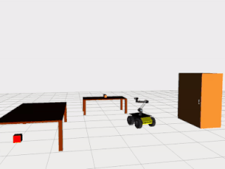
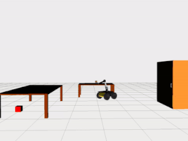
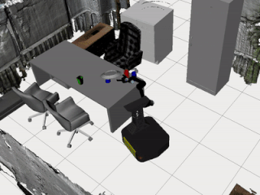
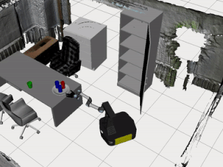
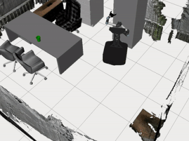

# Planning-on-VKC

  

A motion planning framework for Augmented Kinematic Representation (AKR).

*Only tested with ROS Noetic for Ubuntu 20.04.*

## 1. Installation


### 1.1 Preparation
Firstly, the following dependencies need to be manually installed and set up.
- [ROS Noetic](http://wiki.ros.org/noetic/Installation): we use ROS noetic as our basic platform.
<!-- - [Gurobi Optimizer](https://www.gurobi.com/downloads/gurobi-optimizer-eula/): For Gurobi download and licensed, you need to register an account first (Free academic use if you have an .edu email). Detailed installation documentation is available [here](https://www.gurobi.com/documentation/). -->

After installing the dependencies above, follow the steps below to set the environment

Before compiling our package, several system dependencies need to be installed, use the following command to install

```bash
sudo apt install python3-catkin-tools ros-noetic-octomap-msgs ros-noetic-octomap \
ros-noetic-ompl ros-noetic-octomap-ros ros-noetic-lms1xx ros-noetic-ifopt
```

### 1.2 Clone repositories

We recommend cloning the repository instead of downloading files to avoid submodule errors.

Be sure you have [added ssh key to GitHub account](https://docs.github.com/en/authentication/connecting-to-github-with-ssh/adding-a-new-ssh-key-to-your-github-account) to clone the submodules.

Cloning the repositories(especially submodules) may take up to hours, depending on your network connection.

```bash
cd projects
git clone -b release git@github.com:zyjiao4728/Planning-on-VKC.git --recurse-submodules
cd Planning-on-VKC
git submodule update --init --recursive --progress
rosdep install --from-paths src --ignore-src -r -y
catkin build
```

where `<github-package-url>` is the GitHub download URL of our package.

*Note: Use `--dry-run` to list the packages which will be built.*


## 2. Run Examples

### 2.1 Examples come with the Tesseract package:

``` bash
source <path-to-src>/devel/setup.bash
roslaunch tesseract_ros_example <example-name>.launch
```

### 2.2 Examples come with the vkc package:

#### 2.2.1 Example of using a stick to pick a ball:
The demo shows how a robot tries to pick an object with a tool and operate an articulated object such as opening a cabinet door.
``` bash
source <path-to-src>/devel/setup.bash
roslaunch vkc_example household_env.launch
```
       

        
